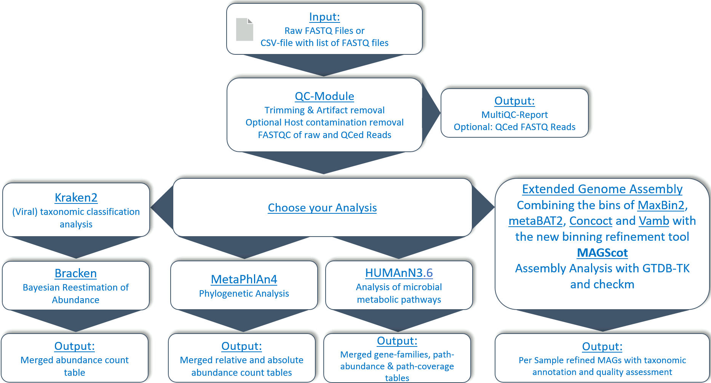

# TOFU-MAaPO

Taxonomic Or FUnctional Metagenomic Assembly and PrOfiling = TOFU-MAaPO 

# Documentation 

Documentation about the pipeline can be found in the `docs/` directory or under the links below:

1. [What happens in this pipeline?](docs/pipeline.md)
2. [Installation and configuration](docs/installation.md)
3. [Running the pipeline](docs/usage.md)
4. [Output](docs/output.md)

# Pipeline Structure

Overview of TOFU-MAaPO 1.3.1

# Overview

This pipelines analyses short reads and can perform analysis of taxonomic profiling, abundance of microbial metabolic pathways and more. 


TOFU-MAaPO is a Nextflow pipeline for the processing and analysis of metagenomic short reads with a focus on gut metagenomes. The pipeline can run on any linux system and needs as dependencies only Nextflow and the container engine Singularity. An installation step is not needed as Nextflow can automatically download all needed files. <br />

The pipeline can install needed databases on its own, see for this the usage documentation. The pipeline can therefor be downloaded and executed in one single command line call. It requires short single- or paired-end metagenomic shotgun sequencing FASTQ files as input, or a single csv file containing a list of samples and their associated FASTQ files or can download data from SRA by giving the project or sample id as an input.<br />

TOFU-MAaPO processes the data for quality control and possible host decontamination (optional) and performs downstream analysis for taxonomic abundance profiles of each sample using Kraken2, Bracken, Salmon and/or Metaphlan4, metabolic pathway analysis using HUMAnN (v3.6) and assembly of metagenomic genomes (MAGs).<br />

Genome assembly is done by generating contigs from the qc'ed reads with Megahit (single samples, grouped or all samples combined). The contigs are then catalogued and indexed using minimap2 and then binned with the option to use up to five binning tools (Metabat2, Concoct, Maxbin, Semibin2 and vamb). The resulting bins will then be refined and, where possible, combined with MAGScoT based on sets of single-copy microbial marker genes from the Genome Taxonomy Database. The profiles of present marker genes in each result from the different binning algorithms are compared, and new hybrid candidate bins are created if the bin sets have a user-adjustable proportion of marker genes. The results are also taxonomically annotated with GTDB-TK and quality checked with checkm. An estimated bin coverage per sample is generated as additional output. 

# Quick start

Install and make sure, Singularity and Nextflow are working.

The inputs to TOFU-MAaPO are fastq.gz files or a SRA ID (sample or project).

Running a  workflow for human gut metagenomes with qc and assembly for local files would be called like this:
```
nextflow run ikmb/TOFU-MAaPO \
    -profile custom \
    --reads '/path/to/fastqfiles/*_R{1,2}_001.fastq.gz' \
    --assembly \
    --genome human \
    --publish_rawbins \
    --outdir results
```

# Funding

The project was funded by the German Research Foundation (DFG) [Research Unit 5042 - miTarget INF](https://www.mitarget.org/).
