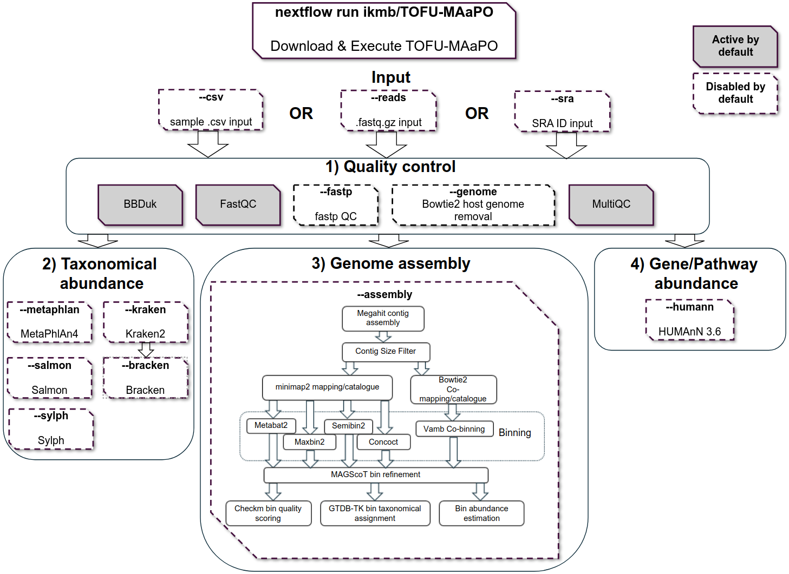

# TOFU-MAaPO

Taxonomic Or FUnctional Metagenomic Assembly and PrOfiling = TOFU-MAaPO 

# Table of content
- [TOFU-MAaPO](#tofu-maapo)
- [Table of content](#table-of-content)
- [Pipeline Structure](#pipeline-structure)
- [Overview](#overview)
- [Quick start](#quick-start)
  - [Prerequisites:](#prerequisites)
  - [Nextflow and Singularity installation](#nextflow-and-singularity-installation)
  - [Download or update TOFU-MAaPO](#download-or-update-tofu-maapo)
  - [Create your config file:](#create-your-config-file)
  - [Running TOFU-MAaPO:](#running-tofu-maapo)
    - [Running quality control:](#running-quality-control)
      - [Locally stored input:](#locally-stored-input)
      - [SRA input:](#sra-input)
    - [Running metabolic gene/pathway estimation with HUMAnN](#running-metabolic-genepathway-estimation-with-humann)
    - [Running assembly module](#running-assembly-module)
    - [Running the taxonomic abundance tool MetaPhlan](#running-the-taxonomic-abundance-tool-metaphlan)
- [Documentation](#documentation)
- [Funding](#funding)

# Pipeline Structure

Overview of TOFU-MAaPO 1.5.0

# Overview

The pipeline analyses metagenomic short reads and can perform analysis for taxonomic profiling, abundance of microbial metabolic pathways and assembly of metagenomic genomes. 


TOFU-MAaPO is a Nextflow pipeline for the processing and analysis of metagenomic short reads with a focus on gut metagenomes. The pipeline can run on any linux system and needs as dependencies only Nextflow and the container engine Singularity. An installation step is not needed as Nextflow can automatically download all needed files. <br />

The pipeline can install needed databases on its own, see for this the usage documentation. The pipeline can therefor be downloaded and executed in one single command line call. It requires short single- or paired-end metagenomic shotgun sequencing FASTQ files as input, or a single csv file containing a list of samples and their associated FASTQ files or can download data from SRA by giving the project or sample id as an input.<br />

TOFU-MAaPO processes the data for quality control and possible host decontamination (optional) and performs downstream analysis for taxonomic abundance profiles of each sample using Kraken2, Bracken, Sylph, Salmon and/or Metaphlan4, metabolic pathway analysis using HUMAnN (v3.6) and assembly of metagenomic genomes (MAGs).<br />

Genome assembly is done by generating contigs from the qc'ed reads with Megahit (single samples individually, grouped or all samples combined). The contigs are then catalogued and indexed using Minimap2 and then binned with the option to use up to five binning tools (Metabat2, Concoct, Maxbin, Semibin2 and vamb). The resulting bins will then be refined and, where possible, combined with MAGScoT based on sets of single-copy microbial marker genes from the Genome Taxonomy Database. The profiles of present marker genes in each result from the different binning algorithms are compared, and new hybrid candidate bins are created if the bin sets share a user-adjustable proportion of marker genes. The results are also taxonomically annotated with GTDB-TK and quality checked with Checkm. An estimated bin coverage per sample is generated as additional output. <br />

# Quick start
## Prerequisites:
This pipeline uses tools that require more computing capacity and memory than a workstation normally has. The tools Semibin for example can use up to 200GB of RAM, while GTDB-TK also uses 100GB of RAM to name two examples. Here, we show you how to run TOFU-MAaPO on a laptop with at least 4 cores and 32GB of memory, but we would not recommend this. A computer system for TOFU-MAaPO has at least 32 cores and a minimum of 128 GB of RAM. We recommend using it on an HPC for larger amounts of data. <br />

## Nextflow and Singularity installation
First, install a suited Java version for Nextflow, we recommend to use SDKMAN for easy Java installation:
```
# Install Java Temurin with SDKMAN (other Java versions might cause bugs)
curl -s https://get.sdkman.io | bash
sdk install java 17.0.10-tem
# Confirm that java is available in version 17.0.10-tem
java -version
#In case another java version is shown: Create and activate a sdk environment in the directory you want to execute the Nextflow pipeline
sdk env init
sdk env
```
Nextflow can be installed and tested with:
```
# Install Nextflow in your current directory:
curl -s https://get.nextflow.io | bash
# Make Nextflow executable:
chmod +x nextflow
# Try a simple Nextflow demo
nextflow run hello
```
Singularity (now Apptainer) can be install either by following the [Singularity Quickstart Guide](https://docs.sylabs.io/guides/3.9/user-guide/quick_start.html) or by installing it via
[Conda](https://docs.conda.io/projects/conda/en/latest/user-guide/install/index.html). With Conda, you can install Singularity without sudo rights. After installation, make sure that the environment is activated and test that Singularity is working:<br />
```
# Create a new conda environment for Singularity
conda create --name sing_env -c conda-forge -c bioconda singularity=3.8 
# Activate environment
conda activate sing_env
# Check whether Singularity has been successfully installed
singularity --version
# Also make sure you can run an example container
singularity run library://sylabsed/examples/lolcow
```

## Download or update TOFU-MAaPO
You can download and update the pipeline directly with Nextflow:<br />
```
nextflow pull ikmb/TOFU-MAaPO
```
You will find the pipeline code stored in `${HOME}/.nextflow/assets/ikmb/TOFU-MAaPO`.<br />
## Create your config file:
We have created a profile/configuration of TOFU-MAaPO with the name "quickstart". This is only designed for TOFU-MAaPO to be run locally in the "home" directory, to use a maximum of 4 cores per process and utilize only up to 32GB of memory. 
To use all the features of TOFU-MAaPO, it is necessary to edit a configuration file so that Nextflow, for example would use a scheduler such as SLURM on an HPC or knows where the reference databases are or will be downloaded to. 
It is also required to declare how much memory and how many CPU cores are available to the pipeline.
Please edit the configurations to your system needs as explained in the [installation and configuration documentation](docs/installation.md).<br />

On a computer system with more than 100GB of RAM and a configured custom.config file you can execute all of the following examples.

## Running TOFU-MAaPO:
The input for TOFU-MAaPO can be either locally stored fastq.gz files or SRA IDs (run, sample or project IDs as comma-separated list).<br />


- [Example for metabolic gene/pathway estimation with HUMAnN](#running-metabolic-genepathway-estimation-with-humann)
- [Example for metagenome assembly](#running-assembly-module-1)
- [Example for taxonomic abundance estimation tool MetaPhlan](#running-the-taxonomic-abundance-tool-metaphlan)

### Running quality control:
The pipeline will by default perform quality control with read trimming, Phix and artefact decontamination and assess the quality pre- and post-qc'ed with fastqc and publish a MultiQC report.  For enabling the optional host genome decontamination, please see our documentation to [install a host genome in TOFU-MAaPO](/docs/hostgenome.md).

#### Locally stored input:
Create a directory to work in and download a publicly available paired-end metagenome  in your home-directory:
```
mkdir -p ${HOME}/tofu-quickstart && cd ${HOME}/tofu-quickstart
wget https://ibdmdb.org/downloads/raw/HMP2/MGX/2018-05-04/PSM6XBR1.tar
tar -xvf PSM6XBR1.tar && rm PSM6XBR1.tar
```

Now start TOFU-MAaPO to perform QC (without host read removal) on the example metagenome with the quickstart profile. This should only take some minutes. <br />
```
nextflow run ikmb/TOFU-MAaPO \
    -profile quickstart \
    --reads '*_R{1,2}.fastq.gz' \
    --cleanreads \
    --outdir results
```
With the parameter `--cleanreads` the qc'ed fastq files will be published into the output directory "results".

#### SRA input:

TOFU-MAaPO can download metagenomes from NCBI SRA by SRA IDs. These can be Project, Sample or Run IDs. For this you need to get an account at NCBI and create your personal NCBI API key from NCBI. You can get your NCBI API key by going to NCBI -> Account -> [Account Settings](https://ncbi.nlm.nih.gov/account/settings/) -> API Key Management.

Create a directory to work in if you haven't done so earlier:
```
mkdir -p ${HOME}/tofu-quickstart && cd ${HOME}/tofu-quickstart
```

A workflow with QC (without host read removal) for a single metagenomic sample with known SRA Run ID as input would look like this:

```
nextflow run ikmb/TOFU-MAaPO \
    -profile quickstart \
    --sra 'SRX3105436' \
    --apikey **YOUR_NCBI_API_KEY** \
    --cleanreads \
    --outdir results
```

### Running metabolic gene/pathway estimation with HUMAnN
**We strongly recommend creating [your own configuration file](/docs/hostgenome.md) for all example runs below.**

In your first run with HUMAnN, you are required to add the parameter `--updatehumann` and `--humann_db /path/to/store/humann/db`, so that TOFU-MAaPO will download the required database to the given path. Please keep in mind that this might take some hours to finish.

Run first:
```
nextflow run ikmb/TOFU-MAaPO \
    -profile custom \
    -c tofu.config \
    --reads '*_R{1,2}.fastq.gz' \
    --humann \
    --updatehumann \
    --humann_db '/path/to/store/humann/db' \
    --outdir results
```

In all future runs, you do not need to download the required database again, so you can skip the parameter `--updatehumann`:

```
nextflow run ikmb/TOFU-MAaPO \
    -profile custom \
    -c tofu.config \
    --reads '*_R{1,2}.fastq.gz' \
    --humann \
    --humann_db '/path/to/store/humann/db' \
    --outdir results
```

### Running assembly module
**We strongly recommend creating [your own configuration file](/docs/hostgenome.md) for all example runs below.**

In your first run with HUMAnN, you are required to add the parameter `--updategtdbtk` and `--gtdbtk_reference /path/to/download/gtdbtk_db/to`, so that TOFU-MAaPO will download the required database to the given path. Please keep in mind that this might take some hours to finish.

```
nextflow run ikmb/TOFU-MAaPO \
    -profile custom \
    -c tofu.config \
    --reads '*_R{1,2}.fastq.gz' \
    --assembly \
    --updategtdbtk \
    --gtdbtk_reference '/path/to/download/gtdbtk_db/to' \
    --outdir results
```

In all future runs, you are not required to download the database again, so you can skip the parameter `--updategtdbtk`:

```
nextflow run ikmb/TOFU-MAaPO \
    -profile custom \
    -c tofu.config \
    --reads '*_R{1,2}.fastq.gz' \
    --assembly \
    --gtdbtk_reference '/path/to/download/gtdbtk_db/to' \
    --outdir results
```

### Running the taxonomic abundance tool MetaPhlan
**We strongly recommend creating [your own configuration file](/docs/hostgenome.md) for all example runs below.**

In your first run with MetaPhlan, you are required to add the parameter `--updatemetaphlan` and `--metaphlan_db /path/to/store/humann/db`, so that TOFU-MAaPO will download the required database to the given path. Please keep in mind that this might take some hours to finish.

```
nextflow run ikmb/TOFU-MAaPO \
    -profile custom \
    -c tofu.config \
    --reads '*_R{1,2}.fastq.gz' \
    --metaphlan \
    --updatemetaphlan \
    --metaphlan_db '/path/to/download/gtdbtk_db/to' \
    --outdir results
```

In all future runs, you are not required to download the database again, so you can skip the parameter `--updatemetaphlan`:

```
nextflow run ikmb/TOFU-MAaPO \
    -profile custom \
    -c tofu.config \
    --reads '*_R{1,2}.fastq.gz' \
    --metaphlan \
    --metaphlan_db '/path/to/download/gtdbtk_db/to' \
    --outdir results
```

For further usage options please see the [usage documentation](docs/usage.md).<br />
# Documentation 

All further documentation about the pipeline can be found in the `docs/` directory or under the links below:

1. [Overview/Flowchart of TOFU-MAaPO](docs/pipeline.md)
2. [Installation and configuration](docs/installation.md)
3. [Available options](docs/usage.md)
4. [Output Structure](docs/output.md)


# Funding

The project was funded by the German Research Foundation (DFG) [Research Unit 5042 - miTarget INF](https://www.mitarget.org/).
