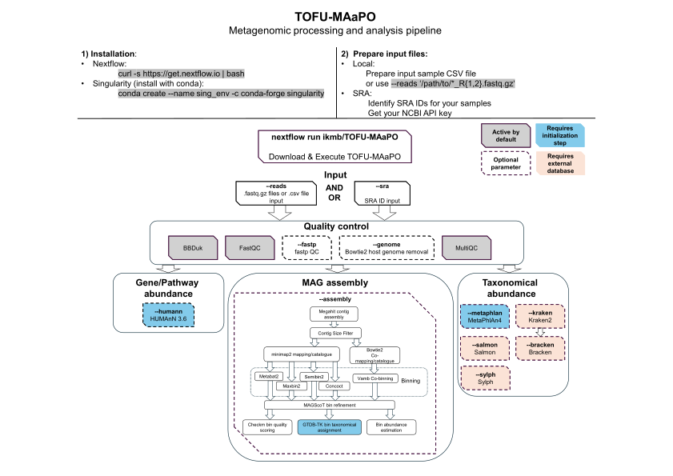

# TOFU-MAaPO

Taxonomic Or FUnctional Metagenomic Assembly and PrOfiling = TOFU-MAaPO 

TOFU-MAaPO is a Nextflow pipeline designed for the analysis of metagenomic short reads. 

It provides comprehensive functionalities for:
- **Quality control**
- **Taxonomic profiling** and microbial abundance estimation
- **Metabolic pathway** analysis
- **Assembly** of metagenome-assembled genomes (MAGs)  

The pipeline is compatible with any Linux system and **requires only two dependencies**:
- **Nextflow** (workflow manager)
- **Singularity** (as the container engine)
  
No software installation step is needed — Nextflow automatically downloads all necessary containers and tools.


# Table of content
- [TOFU-MAaPO](#tofu-maapo)
- [Table of content](#table-of-content)
- [Pipeline Structure](#pipeline-structure)
- [Key features](#key-features)
  - [Input data](#input-data)
  - [Database management](#database-management)
  - [Quality control and preprocessing](#quality-control-and-preprocessing)
  - [Downstream analysis](#downstream-analysis)
    - [Taxonomic Profiling](#taxonomic-profiling)
    - [Metabolic gene/pathway analysis](#metabolic-genepathway-analysis)
    - [Genome assembly](#genome-assembly)
      - [Assembly](#assembly)
      - [Binning](#binning)
      - [Bin refinement](#bin-refinement)
      - [Annotation and Quality Check](#annotation-and-quality-check)
- [Quick start](#quick-start)
  - [Prerequisites:](#prerequisites)
  - [Installing dependencies](#installing-dependencies)
    - [Step 1: Install Nextflow](#step-1-install-nextflow)
    - [Step 2: Install Singularity (Apptainer)](#step-2-install-singularity-apptainer)
  - [Downloading TOFU-MAaPO](#downloading-tofu-maapo)
  - [Configuration](#configuration)
    - [Quickstart profile](#quickstart-profile)
    - [Custom configuration](#custom-configuration)
  - [Example workflows:](#example-workflows)
  - [Running quality control](#running-quality-control)
    - [With Local FASTQ Files](#with-local-fastq-files)
    - [With SRA IDs](#with-sra-ids)
  - [Running metabolic gene/pathway estimation with HUMAnN](#running-metabolic-genepathway-estimation-with-humann)
  - [Running metagenome assembly](#running-metagenome-assembly)
  - [Running taxonomic abundance estimation with MetaPhlAn](#running-taxonomic-abundance-estimation-with-metaphlan)
- [Documentation](#documentation)
- [Funding](#funding)

# Pipeline Structure

Overview of TOFU-MAaPO 1.5.0

# Key features
## Input data
TOFU-MAaPO accepts the following types of input:

* Single- or paired-end metagenomic shotgun sequencing FASTQ files
* A CSV file listing samples and their associated FASTQ files
* Direct download of sequencing data from SRA using project, sample or run IDs

## Database management
The pipeline can download and install the required databases for **GTDBtk**, **MetaPhlAn** and **HUMAnN**. 
Refer to the [**usage documentation**](docs/usage.md#initialization-options) for more details.  

Following tools need manual creation or download of required databases:
* [Bowtie2 (for host genome removal)](docs/hostgenome.md)
* [Kraken2 (with Braken)](https://benlangmead.github.io/aws-indexes/k2)
* [Sylph](https://github.com/bluenote-1577/sylph/wiki/Pre%E2%80%90built-databases)
* Salmon


## Quality control and preprocessing
The quality control includes:
* PreQC quality assessment with **fastqc**
* Read trimming with **BBtools** or **fastp**
* Phix and artifact removal with **BBtools**
* optional host decontamination with **Bowtie2**
* PostQC quality assessment with **fastqc**
* **MultiQC** Report

## Downstream analysis
TOFU-MAaPO can perform following analysis:

### Taxonomic Profiling
Generate taxonomic abundance profiles for your samples with:
- **MetaPhlAn4**
- **Sylph**
- **Salmon** and/or
- **Kraken2** (with optional **Bracken**)

### Metabolic gene/pathway analysis
Utilizes **HUMAnN (v3.6)** to identify microbial metabolic genes/pathways.

### Genome assembly

#### Assembly

Reads are assembled into contigs using **Megahit** (for individual samples, grouped samples, or combined samples).  
Contigs are catalogued and indexed using **Minimap2**.

#### Binning
Binning is performed with up to five tools:
- **Metabat2**
- **Concoct**
- **Maxbin2**
- **Semibin2** and/or
- **Vamb**

#### Bin refinement

The bins are refined and merged where appropriate using [**MAGScoT**](https://github.com/ikmb/MAGScoT): 
Single-copy microbial marker genes from the **Genome Taxonomy Database (GTDB)** are used to profile bins. Hybrid candidate bins are created by comparing marker gene profiles across different binning algorithms (based on user-defined thresholds).

#### Annotation and Quality Check
Following steps are performed with all refined bins:

* Taxonomic annotation with **GTDB-TK**.  
* Quality assessment with **Checkm**.  
* Coverage Analysis

# Quick start
## Prerequisites:

TOFU-MAaPO requires significant computational resources. Ensure your system meets the following minimum requirements:  
- **CPU**: At least 16 cores.  
- **RAM**: At least 128 GB (e.g., Semibin may require up to 200 GB, and GTDB-TK up to 100 GB).  

For large datasets, it is recommended to run the pipeline on a high-performance computing (HPC) system.  

## Installing dependencies
### Step 1: Install Nextflow  

Nextflow requires Java. We recommend using **SDKMAN** for easy Java installation:  

```bash
# Install SDKMAN
curl -s https://get.sdkman.io | bash
# Install Java Temurin with SDKMAN (other Java versions might cause bugs)
sdk install java 17.0.10-tem
# Confirm that java is available in version 17.0.10-tem
java -version
#In case another java version is shown: Create and activate a sdk environment in the directory you want to execute the Nextflow pipeline
sdk env init
sdk env
```
To install and test **Nextflow**:
```bash
# Install Nextflow in your current directory:
curl -s https://get.nextflow.io | bash
# Make Nextflow executable:
chmod +x nextflow
# Try a simple Nextflow demo
nextflow run hello
```
### Step 2: Install Singularity (Apptainer)
You can install Singularity via:
- the [Singularity Quickstart Guide](https://docs.sylabs.io/guides/3.9/user-guide/quick_start.html) or
- [Conda](https://docs.conda.io/projects/conda/en/latest/user-guide/install/index.html) (no `sudo` rights requriered): 
```bash
# Create a new conda environment for Singularity
conda create --name sing_env -c conda-forge -c bioconda singularity=3.8 
# Activate environment
conda activate sing_env
# Check whether Singularity has been successfully installed
singularity --version
# Also make sure you can run an example container
singularity run library://sylabsed/examples/lolcow
```

## Downloading TOFU-MAaPO
Use the following command to download or update the pipeline:<br />
```bash
nextflow pull ikmb/TOFU-MAaPO
```
You will find the pipeline code stored in `${HOME}/.nextflow/assets/ikmb/TOFU-MAaPO`.<br />
## Configuration
### Quickstart profile
TOFU-MAaPO includes a pre-configured quickstart profile for local testing:

- **Cores**: Limited to 4 per process.
- **RAM**: Limited to 32 GB.
- **Directory**: Designed to run in the user's home directory.
> **Note**: The quickstart profile is not recommended for real metagenome data analysis usage.

### Custom configuration
To fully utilize TOFU-MAaPO on an HPC or other systems, **you must create a custom configuration file** specifying:

- **Available CPU cores** and **memory**.
- **Scheduler settings** (e.g., local or SLURM).
- Paths for **reference databases**.

Refer to the [installation and configuration documentation](docs/installation.md) for details.<br />


## Example workflows:
<!-- no toc -->
- [Quickstart with only quality control](#running-quality-control)

- [Metabolic gene/pathway estimation with HUMAnN](#running-metabolic-genepathway-estimation-with-humann)

- [Metagenome assembly](#running-metagenome-assembly)

- [Taxonomic abundance estimation with MetaPhlan](#running-taxonomic-abundance-estimation-with-metaphlan)

## Running quality control
TOFU-MAaPO offers following input options:

- **FASTQ** (.fastq.gz) files: Single or paired-end reads stored locally.
- **SRA IDs**: Run, sample, or project IDs (comma-separated).
### With Local FASTQ Files
1. Create your working directory and download an example dataset:
```bash
mkdir -p ${HOME}/tofu-quickstart && cd ${HOME}/tofu-quickstart
wget https://ibdmdb.org/downloads/raw/HMP2/MGX/2018-05-04/PSM6XBR1.tar
tar -xvf PSM6XBR1.tar && rm PSM6XBR1.tar
```
2. Run the pipeline for quality control:
```bash
nextflow run ikmb/TOFU-MAaPO \
    -profile quickstart \
    --reads '*_R{1,2}.fastq.gz' \
    --cleanreads \
    --outdir results
```
The `--cleanreads` flag copies quality controlled FASTQ files to the `results` directory.

### With SRA IDs
1. Obtain your personal NCBI API key:  
   Go to to NCBI -> Account -> [Account Settings](https://ncbi.nlm.nih.gov/account/settings/) -> API Key Management.
2. Run the pipeline using an SRA Run ID:
```bash
nextflow run ikmb/TOFU-MAaPO \
    -profile quickstart \
    --sra 'SRX3105436' \
    --apikey **YOUR_NCBI_API_KEY** \
    --cleanreads \
    --outdir results
```

## Running metabolic gene/pathway estimation with HUMAnN

**In the first run**, include the following flags to download required databases and run quality control and HUMAnN:
```bash
nextflow run ikmb/TOFU-MAaPO \
    -profile custom \
    -c tofu.config \
    --reads '*_R{1,2}.fastq.gz' \
    --humann \
    --updatehumann \
    --updatemetaphlan \
    --metaphlan_db /path/to/store/metaphlan/db \
    --humann_db '/path/to/store/humann/db' \
    --outdir results
```

**In subsequent runs**, exclude the database update flags `--updatehumann` and `--updatemetaphlan`:

```bash
nextflow run ikmb/TOFU-MAaPO \
    -profile custom \
    -c tofu.config \
    --reads '*_R{1,2}.fastq.gz' \
    --humann \
    --metaphlan_db /path/to/store/metaphlan/db \
    --humann_db '/path/to/store/humann/db' \
    --outdir results
```

> **Hint:** The **paths for the databases can also be entered in the config file**, so that you no longer need to enter them in the command line call.

## Running metagenome assembly
1. **In the first run**, include the flag `--updategtdbtk` for the initial database setup:
```bash
nextflow run ikmb/TOFU-MAaPO \
    -profile custom \
    -c tofu.config \
    --reads '*_R{1,2}.fastq.gz' \
    --assembly \
    --updategtdbtk \
    --gtdbtk_reference '/path/to/download/gtdbtk_db/to' \
    --outdir results
```

2. **For subsequent runs**, exclude the database update flag:

```bash
nextflow run ikmb/TOFU-MAaPO \
    -profile custom \
    -c tofu.config \
    --reads '*_R{1,2}.fastq.gz' \
    --assembly \
    --gtdbtk_reference '/path/to/download/gtdbtk_db/to' \
    --outdir results
```

## Running taxonomic abundance estimation with MetaPhlAn
1. **In your first run**, to download required databases add the `--updatemetaphlan` flag:

```bash
nextflow run ikmb/TOFU-MAaPO \
    -profile custom \
    -c tofu.config \
    --reads '*_R{1,2}.fastq.gz' \
    --metaphlan \
    --updatemetaphlan \
    --metaphlan_db '/path/to/store/metaphlan/db' \
    --outdir results
```

2. **In subsequent runs**, skip the update flag:
```bash
nextflow run ikmb/TOFU-MAaPO \
    -profile custom \
    -c tofu.config \
    --reads '*_R{1,2}.fastq.gz' \
    --metaphlan \
    --metaphlan_db '/path/to/store/metaphlan/db' \
    --outdir results
```

**For detailed usage options**, refer to the [**usage documentation**](docs/usage.md).<br />

# Documentation 

All further documentation about the pipeline can be found in the `docs/` directory or under the links below:

1. [Installation and configuration](docs/installation.md)
2. [Add host genomes to TOFU-MAaPO](docs/hostgenome.md)
3. [Available options](docs/usage.md)
4. [Outputs structure](docs/output.md)


# Funding

The project was funded by the German Research Foundation (DFG) [Research Unit 5042 - miTarget INF](https://www.mitarget.org/).
